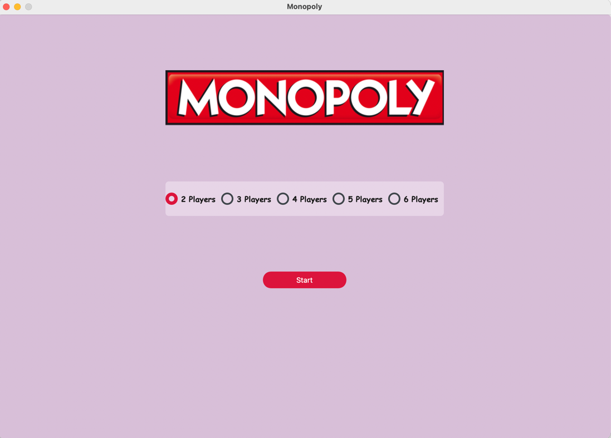
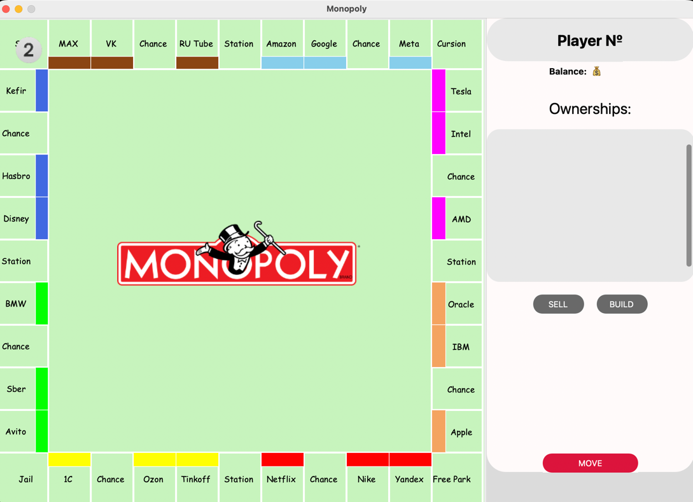
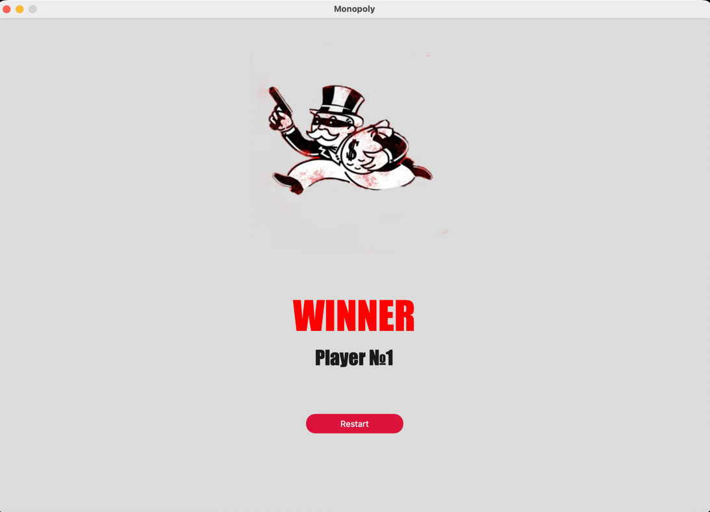

<p align="center">
  
</p>

<h1 align="center">🎲 Monopoly</h1>

<p align="center">
  Графическая desktop-игра по мотивам классической <b>Monopoly</b><br>
  на <b>Python</b> с интерфейсом на <b>CustomTkinter</b> и музыкальным сопровождением на <b>Pygame</b>.
</p>

<p align="center">
  
  
  
  
  
</p>


---

## 🏦 О проекте

> Этот проект — визуальная реализация настольной экономической игры, в которой игроки бросают кубики, перемещаются по полю, покупают компании, получают ренту, строят улучшения и борются за финансовое превосходство до последнего игрока в партии.

Игра сочетает в себе:
- **стильный графический интерфейс**;
- **классическую логику Monopoly**;
- **музыкальное сопровождение**;
- **несколько игровых экранов**: старт, презентация, игровое поле и экран победителя.

---

## ✨ Возможности

<table>
  <tr>
    <td width="33%">
      <h3>🎮 Игровой процесс</h3>
      <ul>
        <li>от <b>2 до 6 игроков</b> в одной партии;</li>
        <li>ходы с помощью броска <b>двух кубиков</b>;</li>
        <li>покупка компаний и станций;</li>
        <li>начисление ренты владельцам;</li>
        <li>продажа активов и управление капиталом.</li>
      </ul>
    </td>
    <td width="33%">
      <h3>🗺️ Спецклетки поля</h3>
      <ul>
        <li><b>Start</b> — старт и прохождение круга;</li>
        <li><b>Chance</b> — случайные события;</li>
        <li><b>Jail</b> — тюрьма;</li>
        <li><b>Free Park</b> — свободная парковка;</li>
        <li>строительство <b>домов</b> и <b>отелей</b>.</li>
      </ul>
    </td>
    <td width="33%">
      <h3>💰 Экономика игры</h3>
      <ul>
        <li>управление балансом игроков;</li>
        <li>покупка и продажа собственности;</li>
        <li>развитие активов и усиление дохода;</li>
        <li>риск потери капитала при неудачных ходах;</li>
        <li>победа через финансовое превосходство.</li>
      </ul>
    </td>
  </tr>
</table>

<table>
  <tr>
    <td width="33%" align="center">
      <h3>🖥️ GUI</h3>
      <p>Окна, кнопки, игровые панели и визуальные элементы на <b>CustomTkinter</b>.</p>
    </td>
    <td width="33%" align="center">
      <h3>🎵 Audio</h3>
      <p>Музыкальные треки и атмосфера игры благодаря <b>Pygame</b>.</p>
    </td>
    <td width="33%" align="center">
      <h3>🏆 Endgame</h3>
      <p>Игра продолжается, пока не останется <b>единственный победитель</b>.</p>
    </td>
  </tr>
</table>

---

## 🧰 Технологии

<p align="center">
  
  
  
  
</p>

- **Python**
- **CustomTkinter**
- **Pillow**
- **Pygame**

---

## 🗂️ Структура проекта

```text
Monopoly/
├── main.py
├── requirements.txt
├── images/              # изображения, логотипы, токены, gif-анимации
├── music/               # музыкальные треки и звуки
└── src/
    ├── controllers/     # игровая логика, финансы, правила, управление игроками
    ├── models/          # модели поля, клеток, игроков, кубиков
    ├── presenter/       # связывает игровую логику и интерфейс
    ├── view/            # окна, виджеты и элементы GUI
    └── constant_view.py # UI-константы и пути к ресурсам
```

---

## 🚀 Установка и запуск

<details open>
<summary><b>1. Клонируйте репозиторий</b></summary>

```bash
git clone https://github.com/yvi7693/Monopoly.git
cd Monopoly
```

</details>

<details>
<summary><b>2. Создайте и активируйте виртуальное окружение</b></summary>

**Windows**
```bash
python -m venv .venv
.venv\Scripts\activate
```

**macOS / Linux**
```bash
python3 -m venv .venv
source .venv/bin/activate
```

</details>

<details>
<summary><b>3. Установите зависимости</b></summary>

```bash
pip install -r requirements.txt
```

</details>

<details open>
<summary><b>4. Запустите игру</b></summary>

```bash
python main.py
```

</details>

---

## 🎲 Как играть

<table>
  <tr>
    <td width="50%">
      <h3>1. Начало партии</h3>
      <p>Запустите приложение, выберите количество игроков на стартовом экране и нажмите <b>Start</b>.</p>
    </td>
    <td width="50%">
      
    </td>
  </tr>
  <tr>
    <td width="50%">
      
    </td>
    <td width="50%">
      <h3>2. Игровой ход</h3>
      <p>Используйте кнопку <b>MOVE</b>, чтобы выполнить ход текущего игрока, переместиться по полю и активировать действие клетки.</p>
    </td>
  </tr>
  <tr>
    <td width="50%">
      <h3>3. Конец игры</h3>
      <p>Покупайте собственность, собирайте ренту, стройте улучшения и при необходимости используйте действия <b>Sell</b> и <b>Build</b>. Игрок который заберет все деньги выигрывает. Нажав на кнопку <b>Restart</b> вы можете перезапустить игру</p>
    </td>
    <td width="50%">
      
    </td>
  </tr>
</table>

### Основные правила
- игроки ходят по очереди;
- при попадании на свободную собственность можно её купить;
- при попадании на чужую собственность выплачивается рента;
- клетки **Chance** меняют баланс случайным образом;
- банкротство выводит игрока из игры;
- побеждает тот, кто остаётся последним.

---

## 🧠 Архитектура

<table>
  <tr>
    <td width="25%" align="center">
      <h3>models</h3>
      <p>Сущности игры: поле, клетки, игроки, кубики и собственность.</p>
    </td>
    <td width="25%" align="center">
      <h3>controllers</h3>
      <p>Правила игры, финансы, операции покупки, продажи и смена хода.</p>
    </td>
    <td width="25%" align="center">
      <h3>view</h3>
      <p>Графический интерфейс: окна, виджеты, кнопки и игровые экраны.</p>
    </td>
    <td width="25%" align="center">
      <h3>presenter</h3>
      <p>Связующее звено между логикой игры и визуальным интерфейсом.</p>
    </td>
  </tr>
</table>

Такое разделение делает проект более понятным, поддерживаемым и удобным для дальнейшего развития.

---

## 📦 Зависимости

Файл `requirements.txt` содержит основные библиотеки проекта:

```txt
customtkinter==5.2.2
pillow==12.1.1
pygame==2.6.1
typing-extensions==4.15.0
```

---

## 👨‍💻 Авторы

<p align="center">
  <b>Product by</b><br>
  <a href="https://github.com/yvi7693">Yaroslav Volkov</a>
</p>

<p align="center">
  <b>Under the leadership of</b><br>
  <a href="https://github.com/dante-pol">Dmitry Rak</a>
</p>

---

<p align="center">
  <i>Build your empire. Buy smart. Survive longer than everyone else. 🏙️</i>
</p>

<p align="center">
  <i>*It is not a commercial product.</i>
</p>
